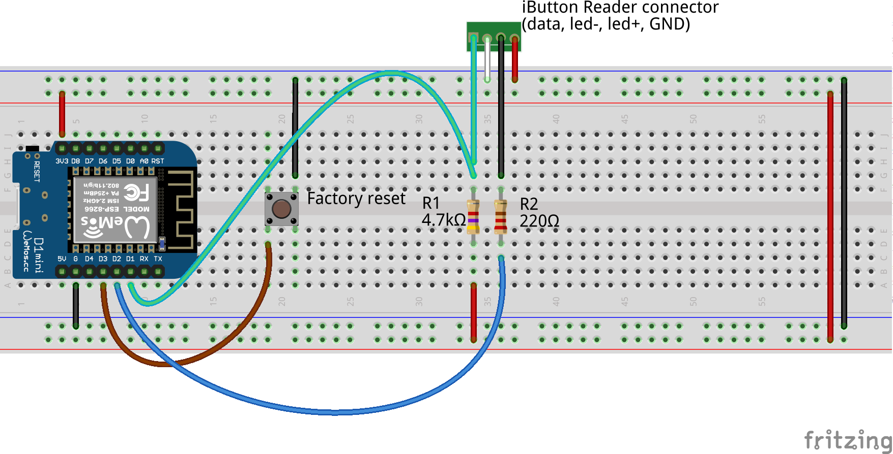

WiFi iButton reader for ESP8266
===============================

This is firmware for simple wireless iButton reader controlled over MQTT.
It uses the [Homie MQTT convention](https://github.com/marvinroger/homie)
and is based on [Homie implementation for ESP8266](https://github.com/marvinroger/homie-esp8266) by Marvin Roger,
benefiting from all the features this library provides, like:
[captive web portal for initial configuration](https://https://homie-esp8266.readme.io/docs/ui-bundle),
[OTA updates over MQTT](https://homie-esp8266.readme.io/docs/ota-configuration-updates#section-ota-updates),
[WiFi reconfiguration over MQTT ](https://homie-esp8266.readme.io/docs/ota-configuration-updates#section-configuration-updates)
etc.

Parts
-----

- [Wemos D1 Mini](https://www.aliexpress.com/wholesale?catId=0&initiative_id=AS_20170313030458&SearchText=wemos+d1+mini)
- [iButton reader](https://www.aliexpress.com/item/TM-probe-DS9092-Zinc-Alloy-probe-iButton-probe-reader-with-LED/32702820667.html)
- 180Ω resistor
- 4.7KΩ resistor
- factory reset button

Wiring
------

- iButton reader data go to D1
- D1 goes through R4.7K to 3.3 V
- iButton LED goes through R180 to D2
- D3 goes through the factory reset button to ground



Setup
-----

Import this code into [platformio](http://platformio.org/), then run build target "PlatformIO: Upload SPIFFS Image".

Then you could compile and upload the sketch to your board as usual.

Once you upload the sketch, you have to configure the node as described in
[Homie Getting Started Tutorial](https://homie-esp8266.readme.io/docs/getting-started)
(this is where you device gets device id assigned)

Interface
---------

- The device will report the iButton address to MQTT topic `homie/<deviceid>/ibutton/address`

- similarly you could control the reader LED by publishing to following topics

```
homie/<deviceid>/led/brightness/set <0..1023>
homie/<deviceid>/led/status/set  <ON|OFF>
```
